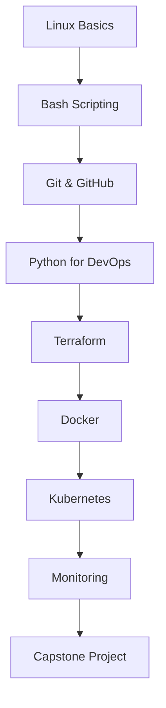

# DevSecOps Course - Complete Training Program


[](https://github.com/hothaifa11/DevSecOps20)
[](LICENSE)
[](https://hothaifa96.github.io/devsecops20)
[](https://github.com/hothaifa96/DevSecOps20/graphs/contributors)
[](https://github.com/hothaifa96/DevSecOps20/commits/main)

## 📋 Table of Contents

- [Course Overview](#-course-overview)
- [Learning Objectives](#-learning-objectives)
- [Course Structure](#-course-structure)
- [Prerequisites](#-prerequisites)
- [Getting Started](#-getting-started)
- [Course Modules](#-course-modules)
- [Lab Environment Setup](#-lab-environment-setup)
- [Assessment & Certification](#-assessment--certification)
- [Resources](#-resources)
- [Contributing](#-contributing)
- [Support](#-support)
- [License](#-license)

## 🎯 Course Overview

Welcome to the **DevSecOps Complete Training Program** - a comprehensive, hands-on course designed to transform you into a skilled DevSecOps engineer. This course combines development, security, and operations practices to create a unified approach to software delivery.

### What You'll Build
By the end of this course, you'll have built:
- A complete CI/CD pipeline with security integration
- Containerized applications with security scanning
- Infrastructure as Code with Terraform
- Kubernetes deployments with monitoring
- Automated security testing and compliance

### Course Format
- **Duration**: 16 weeks (40+ hours of content)
- **Format**: Self-paced with instructor guidance
- **Delivery**: Online with hands-on labs
- **Level**: Beginner to Intermediate
- **Prerequisites**: Basic computer literacy

## 🎓 Learning Objectives

Upon completion of this course, you will be able to:

### Technical Skills
- ✅ Navigate Linux systems with confidence
- ✅ Write robust Bash scripts for automation
- ✅ Implement Git workflows and GitHub collaboration
- ✅ Develop Python applications for DevOps automation
- ✅ Create and manage infrastructure with Terraform
- ✅ Build and deploy containerized applications with Docker
- ✅ Orchestrate applications using Kubernetes
- ✅ Implement comprehensive monitoring and alerting

### Security Integration
- ✅ Integrate security into CI/CD pipelines
- ✅ Implement container security best practices
- ✅ Perform infrastructure security scanning
- ✅ Set up security monitoring and incident response

### Professional Skills
- ✅ Apply DevSecOps principles in real-world scenarios
- ✅ Troubleshoot complex distributed systems
- ✅ Collaborate effectively in cross-functional teams
- ✅ Document and communicate technical solutions

## 📚 Course Structure

### Module Breakdown
| Module | Topic | Lessons | Duration | Type |
|--------|--------|---------|----------|------|
| 1 | [Linux Basics](#module-1-linux-basics) | 4 | 8 hours | Foundation |
| 2 | [Bash Scripting](#module-2-bash-scripting) | 6 | 12 hours | Scripting |
| 3 | [Git & GitHub](#module-3-git--github) | 4 | 8 hours | Version Control |
| 4 | [Python for DevOps](#module-4-python-for-devops) | 12 | 24 hours | Programming |
| 5 | [Terraform](#module-5-terraform) | 2 | 4 hours | IaC |
| 6 | [Docker](#module-6-docker) | 3 | 6 hours | Containerization |
| 7 | [Kubernetes](#module-7-kubernetes) | 8 | 16 hours | Orchestration |
| 8 | [Monitoring](#module-8-monitoring) | 5 | 10 hours | Observability |

### Learning Path


## ⚡ Prerequisites

### Required Knowledge
- Basic computer literacy
- Familiarity with command-line interfaces (helpful but not required)
- Understanding of software development concepts (helpful but not required)

### Technical Requirements
- **Operating System**: Linux, macOS, or Windows (with WSL2)
- **Hardware**: 8GB RAM minimum (16GB recommended)
- **Internet**: Stable broadband connection
- **Storage**: 50GB free disk space

### Accounts Needed
- GitHub account (free)
- Docker Hub account (free)
- Cloud provider account (AWS/GCP/Azure - free tier available)

## 🚀 Getting Started

### Quick Start Guide

1. **Clone the Repository**
   ```bash
   git clone https://github.com/hothaifa11/DevSecOps20.git
   cd DevSecOps20
   ```

2. **Set Up Your Environment**
   ```bash
   # Install required tools
   ./scripts/setup-environment.sh
   
   # Verify installation
   ./scripts/verify-setup.sh
   ```

3. **Start Learning**
   - Visit the [Course Website](https://hothaifa11.github.io/DevSecOps20)
   - Begin with [Module 1: Linux Basics](lessons/01-linux-basics/README.md)
   - Follow the structured learning path

### Alternative Setup Methods
- **Docker Environment**: Use our pre-configured Docker container
- **Vagrant Environment**: Use our Vagrant setup for consistent environments
- **Cloud Environment**: Use cloud-based development environments

## 📖 Course Modules

### Module 1: Linux Basics
**Duration**: 8 hours | **Lessons**: 4 | **Labs**: 4

Learn the fundamental skills needed to work with Linux systems in DevSecOps environments.

- **Lesson 1**: Introduction to Linux & Command Line
- **Lesson 2**: File System Navigation & Basic Commands
- **Lesson 3**: File Permissions & User Management
- **Lesson 4**: Process Management & System Monitoring

**Key Skills**: File operations, user management, process control, system monitoring

### Module 2: Bash Scripting
**Duration**: 12 hours | **Lessons**: 6 | **Labs**: 6

Master automation through powerful Bash scripting techniques.

- **Lesson 1**: Bash Fundamentals & Variables
- **Lesson 2**: Control Structures (if/else, loops)
- **Lesson 3**: Functions & Script Organization
- **Lesson 4**: File Operations & Text Processing
- **Lesson 5**: Error Handling & Debugging
- **Lesson 6**: Advanced Scripting & Automation

**Key Skills**: Script writing, automation, error handling, debugging

### Module 3: Git & GitHub
**Duration**: 8 hours | **Lessons**: 4 | **Labs**: 4

Implement version control and collaboration workflows essential for DevSecOps.

- **Lesson 1**: Git Basics & Version Control Concepts
- **Lesson 2**: Branching, Merging & Conflict Resolution
- **Lesson 3**: GitHub Workflows & Collaboration
- **Lesson 4**: CI/CD with GitHub Actions

**Key Skills**: Version control, branching strategies, collaboration, CI/CD

### Module 4: Python for DevOps
**Duration**: 24 hours | **Lessons**: 12 | **Labs**: 12

Develop Python skills specifically for DevSecOps automation and tooling.

- **Lesson 1**: Python Basics & Syntax
- **Lesson 2**: Data Structures & Control Flow
- **Lesson 3**: Functions & Modules
- **Lesson 4**: Object-Oriented Programming
- **Lesson 5**: File Handling & I/O
- **Lesson 6**: Error Handling & Exceptions
- **Lesson 7**: Working with APIs & Requests
- **Lesson 8**: Testing & Test-Driven Development
- **Lesson 9**: Automation & Scripting
- **Lesson 10**: Security & Best Practices
- **Lesson 11**: DevOps Libraries & Tools
- **Lesson 12**: Final Python Project

**Key Skills**: Python programming, automation, API integration, testing

### Module 5: Terraform
**Duration**: 4 hours | **Lessons**: 2 | **Labs**: 2

Implement Infrastructure as Code with Terraform for scalable deployments.

- **Lesson 1**: Infrastructure as Code & Terraform Basics
- **Lesson 2**: Advanced Terraform & State Management

**Key Skills**: IaC principles, resource management, state handling

### Module 6: Docker
**Duration**: 6 hours | **Lessons**: 3 | **Labs**: 3

Containerize applications with Docker for consistent deployments.

- **Lesson 1**: Containerization Concepts & Docker Basics
- **Lesson 2**: Docker Compose & Multi-container Applications
- **Lesson 3**: Docker Security & Best Practices

**Key Skills**: Containerization, Docker Compose, container security

### Module 7: Kubernetes
**Duration**: 16 hours | **Lessons**: 8 | **Labs**: 8

Orchestrate containerized applications at scale with Kubernetes.

- **Lesson 1**: Kubernetes Architecture & Concepts
- **Lesson 2**: Pods, Services & Deployments
- **Lesson 3**: ConfigMaps, Secrets & Volumes
- **Lesson 4**: Ingress & Networking
- **Lesson 5**: Helm & Package Management
- **Lesson 6**: Monitoring & Logging
- **Lesson 7**: Security & RBAC
- **Lesson 8**: CI/CD with Kubernetes

**Key Skills**: Container orchestration, service mesh, security, monitoring

### Module 8: Monitoring
**Duration**: 10 hours | **Lessons**: 5 | **Labs**: 5

Implement comprehensive monitoring and observability solutions.

- **Lesson 1**: Monitoring Fundamentals & Metrics
- **Lesson 2**: Prometheus & Grafana
- **Lesson 3**: Logging with ELK Stack
- **Lesson 4**: Application Performance Monitoring
- **Lesson 5**: Security Monitoring & Alerting

**Key Skills**: Metrics collection, visualization, log analysis, alerting

## 🛠️ Lab Environment Setup

### Option 1: Local Development
```bash
# Install Docker
curl -fsSL https://get.docker.com -o get-docker.sh
sh get-docker.sh

# Install kubectl
curl -LO "https://dl.k8s.io/release/$(curl -L -s https://dl.k8s.io/release/stable.txt)/bin/linux/amd64/kubectl"

# Install Terraform
wget https://releases.hashicorp.com/terraform/1.0.0/terraform_1.0.0_linux_amd64.zip
unzip terraform_1.0.0_linux_amd64.zip
sudo mv terraform /usr/local/bin/
```

### Option 2: Docker-based Environment
```bash
# Run the complete lab environment
docker-compose up -d

# Access the environment
docker exec -it devsecops-lab bash
```

### Option 3: Cloud-based Environment
- **AWS Cloud9**: Pre-configured development environment
- **Google Cloud Shell**: Browser-based environment
- **Azure Cloud Shell**: Integrated cloud development

## 🎯 Assessment & Certification

### Assessment Types
- **Knowledge Checks**: End-of-lesson quizzes (40%)
- **Practical Labs**: Hands-on exercises (40%)
- **Capstone Project**: Complete DevSecOps pipeline (20%)

### Certification Requirements
- Complete all 8 modules
- Pass all assessments with 80% or higher
- Submit capstone project
- Peer review participation

### Capstone Project
Build a complete DevSecOps pipeline including:
- Multi-tier application deployment
- Infrastructure as Code
- Automated testing and security scanning
- Monitoring and alerting
- Documentation and presentation

## 📚 Resources

### Essential Reading
- [DevSecOps Fundamentals](resources/devsecops-fundamentals.md)
- [Security Best Practices](resources/security-best-practices.md)
- [Troubleshooting Guide](resources/troubleshooting.md)

### External Resources
- [DevSecOps.org](https://devsecops.org/)
- [OWASP DevSecOps Guideline](https://owasp.org/www-project-devsecops-guideline/)
- [NIST Cybersecurity Framework](https://www.nist.gov/cyberframework)

### Community & Support
- [Discord Community](https://discord.gg/DevSecOps20)
- [GitHub Discussions](https://github.com/hothaifa11/DevSecOps20/discussions)
- [Office Hours](https://calendly.com/instructor/office-hours)

## 🤝 Contributing

We welcome contributions from the community! Here's how you can help:

### Ways to Contribute
- **Content**: Improve lessons, add examples, fix typos
- **Labs**: Create new exercises, improve existing ones
- **Tools**: Develop automation scripts, improve setup
- **Documentation**: Enhance guides, add translations

### Contribution Process
1. Fork the repository
2. Create a feature branch
3. Make your changes
4. Submit a pull request
5. Participate in code review

### Contributor Guidelines
- Follow the [Code of Conduct](CODE_OF_CONDUCT.md)
- Use clear commit messages
- Test your changes thoroughly
- Update documentation as needed

## 📞 Support

### Getting Help
- **GitHub Issues**: For bugs and feature requests
- **GitHub Discussions**: For questions and community help
- **Email**: instructor@DevSecOps20.com
- **Office Hours**: Weekly virtual sessions

### Response Times
- **Issues**: 24-48 hours
- **Discussions**: 12-24 hours
- **Email**: 48-72 hours
- **Emergency**: Use priority support channels

### Feedback
We value your feedback! Please share your experience:
- Course satisfaction surveys
- Lesson-specific feedback forms
- Direct instructor feedback
- Community testimonials

## 📄 License

This project is licensed under the MIT License - see the [LICENSE](LICENSE) file for details.

### What This Means
- ✅ Free to use for personal and commercial purposes
- ✅ Modify and distribute as needed
- ✅ Include copyright notice and license
- ❌ No warranty provided

## 🏆 Acknowledgments

Special thanks to:
- Industry experts who reviewed the curriculum
- Open source projects that make this course possible
- Early adopters who provided valuable feedback
- Community contributors who continue to improve the course

## 📈 Course Statistics

- **Total Lessons**: 44
- **Hands-on Labs**: 40+
- **Code Examples**: 200+
- **Practice Exercises**: 150+
- **Assessment Questions**: 300+
- **Estimated Completion**: 16 weeks

---

## 🎯 Ready to Start Your DevSecOps Journey?

1. **Star this repository** to stay updated
2. **Join our community** for support and networking
3. **Begin with Module 1** and follow the structured path
4. **Complete the labs** to reinforce your learning
5. **Share your progress** with the community

### Quick Links
- 🌐 [Course Website](https://hothaifa11.github.io/DevSecOps20)
- 📚 [Start Learning](lessons/01-linux-basics/README.md)
- 🛠️ [Setup Guide](docs/setup-guide.md)
- 💬 [Join Community](https://discord.gg/DevSecOps20)
- 📧 [Contact Instructor](mailto:instructor@DevSecOps20.com)

---

**Made with ❤️ by the DevSecOps Course Team**

*Last updated: July 2025*