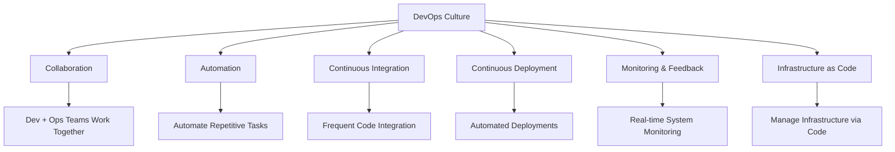
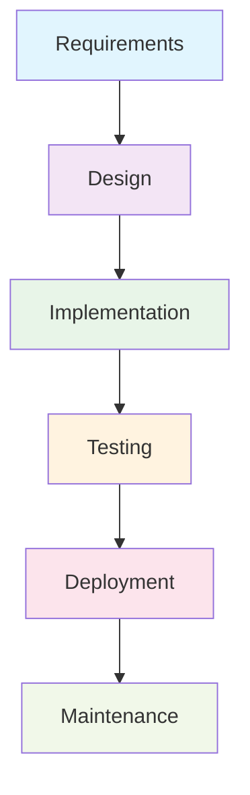
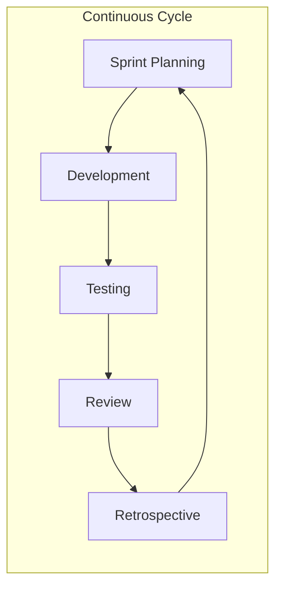
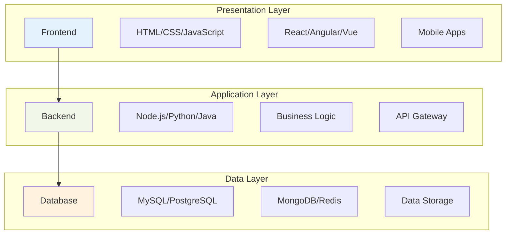
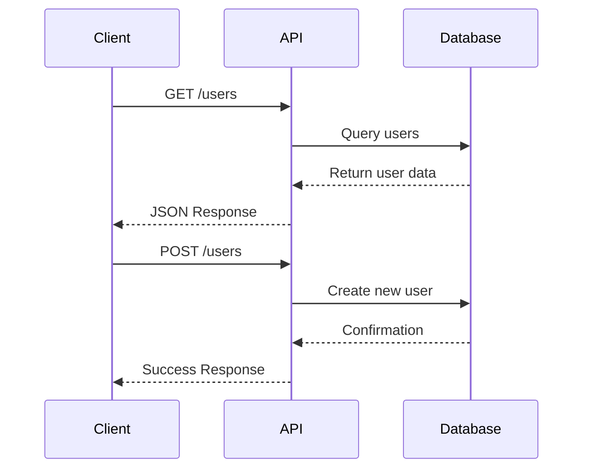
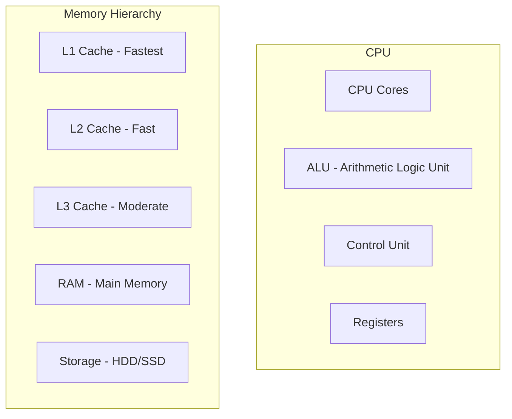
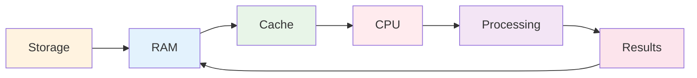
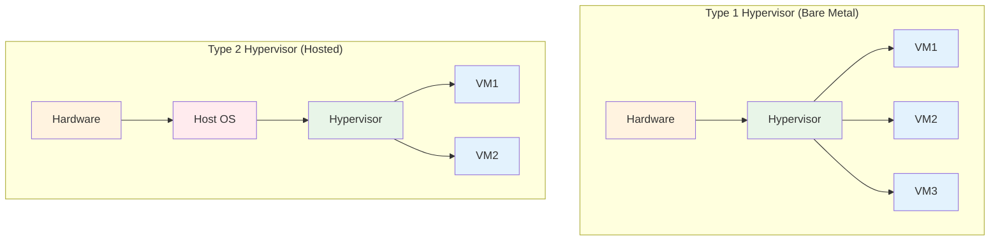
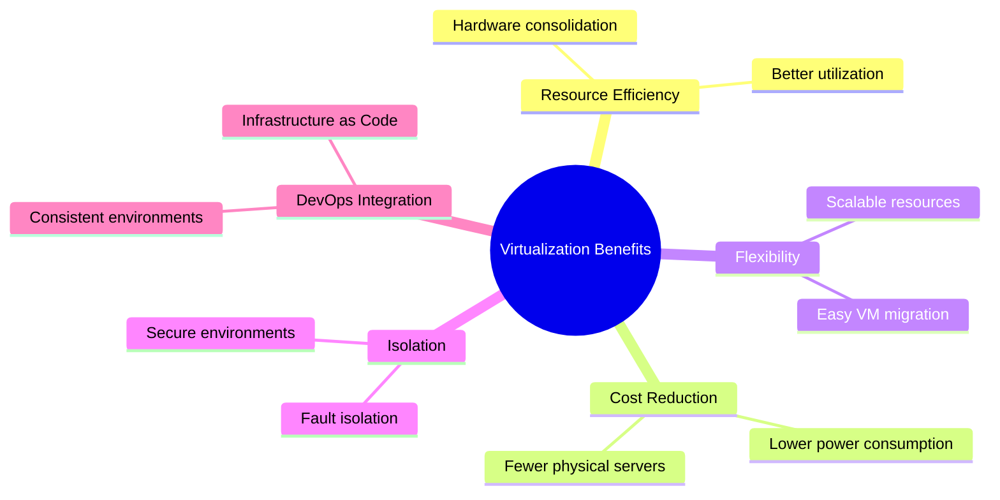

# DevOps & Linux Fundamentals - Lesson 1 Summary

## Table of Contents

1. [What is DevOps and Core Principles](#what-is-devops-and-core-principles)
2. [Software Development Life Cycle (SDLC)](#software-development-life-cycle-sdlc)
3. [Application Architecture Basics](#application-architecture-basics)
4. [Computer Systems Architecture](#computer-systems-architecture)
5. [Virtualization and Hypervisors](#virtualization-and-hypervisors)
6. [Key Takeaways](#key-takeaways)

---

## What is DevOps and Core Principles

### Definition

DevOps is a cultural and technical movement that emphasizes collaboration between Development (Dev) and Operations (Ops) teams to deliver software faster, more reliably, and with higher quality.

### Core Principles We'll Learn



### Key Benefits

- **Faster Time to Market**: Reduced deployment cycles
- **Higher Quality**: Automated testing and deployment
- **Better Collaboration**: Shared responsibility model
- **Increased Reliability**: Consistent environments and processes

---

## Software Development Life Cycle (SDLC)

### Traditional Waterfall Model



**Characteristics:**

- Sequential phases
- Each phase must complete before the next begins
- Documentation-heavy
- Less flexible to changes

### Agile Model



**Characteristics:**

- Iterative and incremental
- Customer collaboration
- Responding to change
- Working software over documentation

### Comparison Table

| Aspect                   | Waterfall | Agile      |
| ------------------------ | --------- | ---------- |
| **Flexibility**          | Low       | High       |
| **Customer Involvement** | Limited   | Continuous |
| **Documentation**        | Extensive | Minimal    |
| **Risk Management**      | High risk | Lower risk |
| **Time to Market**       | Longer    | Shorter    |

---

## Application Architecture Basics

### Three-Tier Architecture



### REST API Basics

REST (Representational State Transfer) is an architectural style for designing networked applications.



**HTTP Methods:**

- `GET`: Retrieve data
- `POST`: Create new data
- `PUT`: Update existing data
- `DELETE`: Remove data

**Example REST Endpoints:**

```
GET    /api/users          # Get all users
GET    /api/users/123      # Get user by ID
POST   /api/users          # Create new user
PUT    /api/users/123      # Update user
DELETE /api/users/123      # Delete user
```

---

## Computer Systems Architecture

### CPU, RAM, Cache, and Storage Relationship



### Data Processing Flow



### CPU Scheduling Algorithms

#### Round Robin Scheduling

```mermaid
gantt
    title Round Robin CPU Scheduling (Time Quantum = 3)
    dateFormat X
    axisFormat %s

    section Process A
    P1: 0, 3
    P1: 9, 12

    section Process B
    P2: 3, 6
    P2: 12, 15

    section Process C
    P3: 6, 9
    P3: 15, 18
```



**Characteristics:**

- Each process gets equal time slice (quantum)
- Fair scheduling for all processes
- Prevents process starvation
- Good for interactive systems

#### Quantum Time Slice

- **Small quantum**: More responsive but higher overhead
- **Large quantum**: Less overhead but less responsive
- **Typical values**: 10-100 milliseconds

---

## Virtualization and Hypervisors

### Types of Hypervisors



### Comparison Table

| Feature               | Type 1 (Bare Metal)     | Type 2 (Hosted)                |
| --------------------- | ----------------------- | ------------------------------ |
| **Performance**       | High                    | Moderate                       |
| **Resource Overhead** | Low                     | Higher                         |
| **Installation**      | Complex                 | Simple                         |
| **Use Case**          | Data centers, servers   | Desktop virtualization         |
| **Examples**          | VMware vSphere, Hyper-V | VirtualBox, VMware Workstation |

### Virtualization Benefits



---

## Key Takeaways

### What We Learned Today

1. **DevOps Fundamentals**

   - Culture of collaboration between Dev and Ops
   - Automation and continuous improvement
   - Faster, more reliable software delivery

2. **SDLC Models**

   - Waterfall: Sequential, documentation-heavy
   - Agile: Iterative, customer-focused, flexible

3. **Application Architecture**

   - Three-tier architecture: Frontend, Backend, Database
   - REST API principles and HTTP methods
   - Separation of concerns

4. **System Architecture**

   - Memory hierarchy: CPU → Cache → RAM → Storage
   - Round Robin scheduling for fair CPU time allocation
   - Quantum time slices for process management

5. **Virtualization**
   - Type 1 hypervisors: Direct hardware access
   - Type 2 hypervisors: Hosted on operating systems
   - Benefits for resource efficiency and DevOps practices

### Next Steps

- Hands-on Linux command line basics
- Setting up virtual machines
- Introduction to containerization (Docker)
- Basic scripting and automation
- Version control with Git

---

## Recommended Study Materials

### Books

- "The Phoenix Project" by Gene Kim
- "The DevOps Handbook" by Gene Kim
- "Linux Command Line and Shell Scripting Bible"
