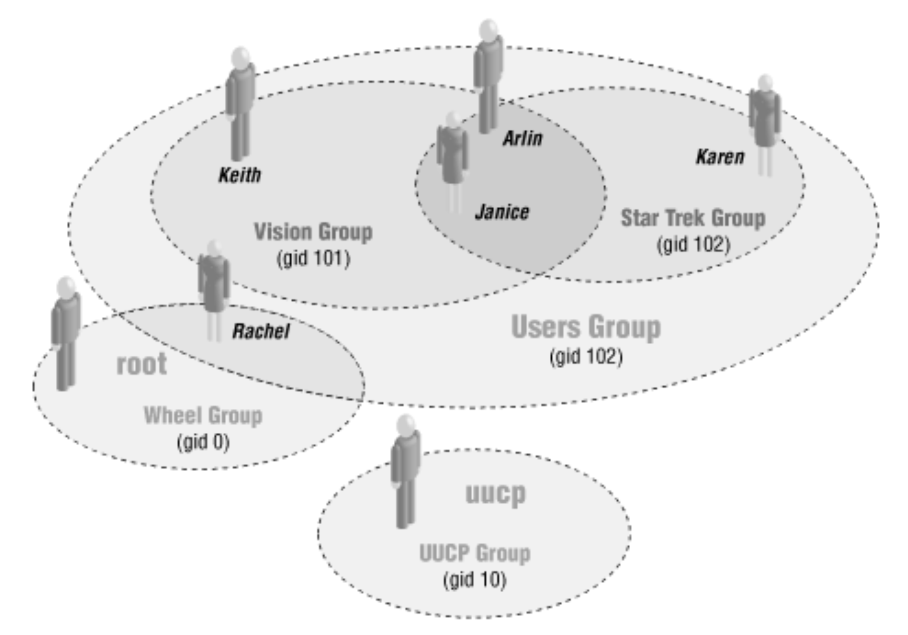
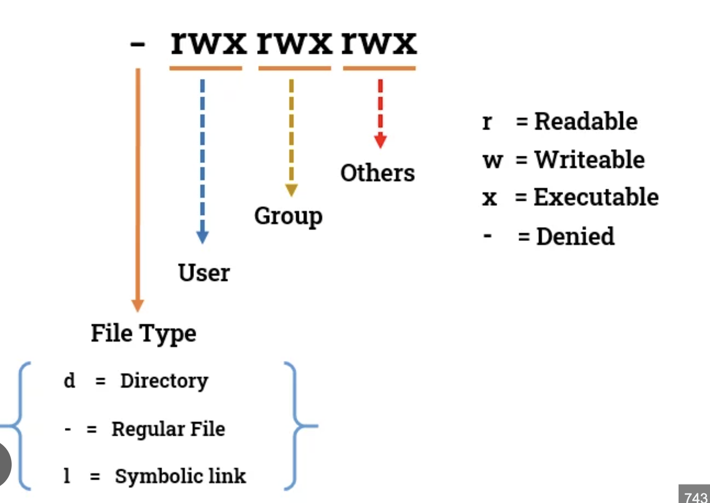
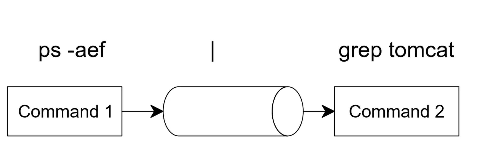

# DevOps Lesson: Number Systems, Users, Permissions & Command Line

## Table of Contents
1. [Number Systems](#number-systems)
2. [Users and Groups in Ubuntu Linux](#users-and-groups-in-ubuntu-linux)
3. [File Permissions](#file-permissions)
4. [Sudo and System Files](#sudo-and-system-files)
5. [Command Line I/O and Piping](#command-line-io-and-piping)
6. [Text Processing Tools](#text-processing-tools)

---

## Number Systems

### Binary System (Base 2)
Binary uses only two digits: **0** and **1**.

**Converting Decimal to Binary:**
- 13 in decimal = 1101 in binary
- Process: 13 ÷ 2 = 6 remainder 1, 6 ÷ 2 = 3 remainder 0, 3 ÷ 2 = 1 remainder 1, 1 ÷ 2 = 0 remainder 1
- Reading remainders from bottom to top: 1101

**Converting Binary to Decimal:**
- 1101 = (1×2³) + (1×2²) + (0×2¹) + (1×2⁰) = 8 + 4 + 0 + 1 = 13

### Hexadecimal System (Base 16)
Hexadecimal uses 16 digits: **0-9** and **A-F** (where A=10, B=11, C=12, D=13, E=14, F=15).

**Converting Decimal to Hexadecimal:**
- 255 in decimal = FF in hexadecimal
- Process: 255 ÷ 16 = 15 remainder 15 (F), 15 ÷ 16 = 0 remainder 15 (F)

**Converting Hexadecimal to Decimal:**
- FF = (15×16¹) + (15×16⁰) = 240 + 15 = 255

**Common Usage:**
- IP addresses, MAC addresses, color codes in web design
- Memory addresses in programming
- File permissions in octal/hex representation

---

## Users and Groups in Ubuntu Linux

### Understanding Users and Groups
- **User**: An account that can log into the system
- **Group**: A collection of users with shared permissions
- **Primary Group**: The main group assigned to a user
- **Secondary Groups**: Additional groups a user belongs to

### User Management Commands

#### Creating Users
```bash
# Create a new user
sudo useradd username

# Create user with home directory
sudo useradd -m username

# Create user with specific shell
sudo useradd -m -s /bin/bash username

# Create user with additional info
sudo useradd -m -c "Full Name" -s /bin/bash username
```

#### Modifying Users
```bash
# Change user's home directory
sudo usermod -d /new/home/path username

# Add user to a group
sudo usermod -a -G groupname username

# Change user's shell
sudo usermod -s /bin/zsh username

# Lock a user account
sudo usermod -L username

# Unlock a user account
sudo usermod -U username
```

#### Deleting Users
```bash
# Delete user (keeping home directory)
sudo userdel username

# Delete user and home directory
sudo userdel -r username
```

#### Password Management
```bash
# Set password for user
sudo passwd username

# Force password change on next login
sudo passwd -e username

# Lock user password
sudo passwd -l username

# Unlock user password
sudo passwd -u username
```

### Group Management Commands

#### Creating Groups
```bash
# Create a new group
sudo groupadd groupname

# Create group with specific GID
sudo groupadd -g 1500 groupname
```

#### Modifying Groups
```bash
# Add user to group
sudo gpasswd -a username groupname

# Remove user from group
sudo gpasswd -d username groupname

# Change group name
sudo groupmod -n newname oldname
```

#### Deleting Groups
```bash
# Delete a group
sudo groupdel groupname
```

### Information Commands
```bash
# Display current user
whoami

# Display user ID and group information
id

# Display all users
cat /etc/passwd

# Display all groups
cat /etc/group

# Display groups for specific user
groups username

# Display detailed user information
finger username
```

---

## File Permissions

### Understanding Permission Notation
The permission string `drwxrwxrwx` breaks down as:
- **d**: File type (d=directory, -=file, l=link)
- **rwx**: Owner permissions (read, write, execute)
- **rwx**: Group permissions (read, write, execute)
- **rwx**: Other permissions (read, write, execute)

### Permission Types

- **r (read)**: Permission to read file content or list directory contents
- **w (write)**: Permission to modify file or create/delete files in directory
- **x (execute)**: Permission to run file as program or access directory

### Binary Permission System
Each permission set uses 3 bits:
- **r = 4** (100 in binary)
- **w = 2** (010 in binary)
- **x = 1** (001 in binary)

**Common Permission Combinations:**
- **7 (rwx)**: 4+2+1 = Full permissions
- **6 (rw-)**: 4+2+0 = Read and write
- **5 (r-x)**: 4+0+1 = Read and execute
- **4 (r--)**: 4+0+0 = Read only
- **3 (-wx)**: 0+2+1 = Write and execute
- **2 (-w-)**: 0+2+0 = Write only
- **1 (--x)**: 0+0+1 = Execute only
- **0 (---)**: 0+0+0 = No permissions

### chmod Command
```bash
# Using numeric notation
chmod 755 filename    # rwxr-xr-x
chmod 644 filename    # rw-r--r--
chmod 600 filename    # rw-------

# Using symbolic notation
chmod u+x filename    # Add execute for user
chmod g-w filename    # Remove write for group
chmod o=r filename    # Set other to read only
chmod a+r filename    # Add read for all

# Recursive permission change
chmod -R 755 directory/

# Common symbolic operators
# u=user, g=group, o=other, a=all
# +=add, -=remove, ==set exactly
```

### chown Command
```bash
# Change owner
sudo chown username filename

# Change owner and group
sudo chown username:groupname filename

# Change only group
sudo chown :groupname filename

# Recursive ownership change
sudo chown -R username:groupname directory/

# Change using numeric IDs
sudo chown 1001:1001 filename
```

### Special Permissions
```bash
# Set SUID bit (4000)
chmod 4755 filename

# Set SGID bit (2000)
chmod 2755 filename

# Set sticky bit (1000)
chmod 1755 filename

# Combined: SUID + SGID + Sticky
chmod 7755 filename
```

---

## Sudo and System Files

### Understanding Sudo
**Sudo** (Super User Do) allows users to run commands with elevated privileges.

### Sudo Configuration
```bash
# Edit sudoers file (always use visudo)
sudo visudo

# Add user to sudo group
sudo usermod -a -G sudo username

# Check sudo access
sudo -l

# Run command as different user
sudo -u username command
```

### /etc/passwd File Structure
The `/etc/passwd` file contains user account information:
```
username:password:UID:GID:comment:home_directory:shell
```

**Example:**
```
john:x:1001:1001:John Doe:/home/john:/bin/bash
```

**Field Breakdown:**
- **username**: Login name
- **password**: 'x' indicates password stored in /etc/shadow
- **UID**: User ID number
- **GID**: Primary group ID
- **comment**: Full name or description
- **home_directory**: User's home directory path
- **shell**: Default shell program

### Related System Files
```bash
# Shadow file (encrypted passwords)
/etc/shadow

# Group information
/etc/group

# Group passwords
/etc/gshadow

# Default user settings
/etc/default/useradd

# Login definitions
/etc/login.defs
```

---

## Command Line I/O and Piping


### Standard Streams
- **stdin (0)**: Standard input
- **stdout (1)**: Standard output  
- **stderr (2)**: Standard error

### Redirection Operators
```bash
# Redirect stdout to file
command > output.txt

# Redirect stderr to file
command 2> error.txt

# Redirect both stdout and stderr
command > output.txt 2>&1
command &> output.txt

# Append to file
command >> output.txt

# Redirect stdin from file
command < input.txt

# Here document
command << EOF
input text
EOF
```

### Piping
The pipe operator `|` connects the output of one command to the input of another:

```bash
# Basic piping
ls -la | grep "txt"

# Multiple pipes
ps aux | grep "python" | wc -l

# Combine with redirection
ls -la | grep "txt" > text_files.txt
```

### tee Command

The `tee` command reads from stdin and writes to both stdout and files:

```bash
# Write to file and display
ls -la | tee file_list.txt

# Append to file and display
ls -la | tee -a file_list.txt

# Write to multiple files
echo "Hello" | tee file1.txt file2.txt file3.txt

# Combine with pipes
ps aux | tee process_list.txt | grep "python"
```

---

## Text Processing Tools

### cut Command
Extract specific columns or characters from text:

```bash
# Cut by character position
cut -c 1-5 filename

# Cut by delimiter (default is tab)
cut -d',' -f1,3 filename.csv

# Cut by field range
cut -d':' -f1-3 /etc/passwd

# Cut multiple fields
cut -d' ' -f1,3,5 filename

# Examples
echo "apple,banana,cherry" | cut -d',' -f2    # Output: banana
cut -d':' -f1 /etc/passwd                     # Extract usernames
```

### wc Command
Count lines, words, and characters:

```bash
# Count lines, words, characters
wc filename

# Count only lines
wc -l filename

# Count only words
wc -w filename

# Count only characters
wc -c filename

# Count only bytes
wc -c filename

# Examples
ls | wc -l                    # Count files in directory
cat /etc/passwd | wc -l       # Count number of users
```

### Additional Useful Tools

#### grep Command
```bash
# Basic search
grep "pattern" filename

# Case insensitive
grep -i "pattern" filename

# Recursive search
grep -r "pattern" directory/

# Count matches
grep -c "pattern" filename

# Show line numbers
grep -n "pattern" filename
```

#### sort Command
```bash
# Sort lines alphabetically
sort filename

# Sort numerically
sort -n filename

# Reverse sort
sort -r filename

# Sort by specific field
sort -k 2 filename
```

#### uniq Command
```bash
# Remove duplicate lines
uniq filename

# Count occurrences
uniq -c filename

# Show only duplicates
uniq -d filename
```

### Command Chaining Examples
```bash
# Find most common commands in bash history
history | cut -d' ' -f4 | sort | uniq -c | sort -nr | head -10

# Count unique users in system
cut -d':' -f1 /etc/passwd | sort | uniq | wc -l

# Find files and show permissions
find /home -type f | head -20 | xargs ls -la | cut -d' ' -f1 | sort | uniq -c

# Process log files
grep "ERROR" /var/log/syslog | cut -d' ' -f1-3 | sort | uniq -c
```

---
